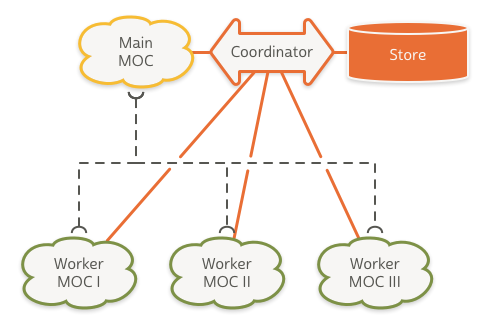
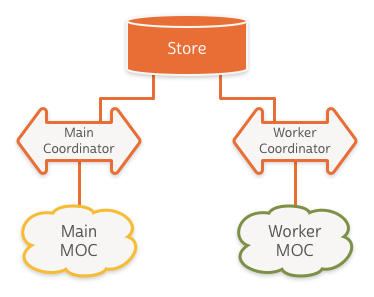
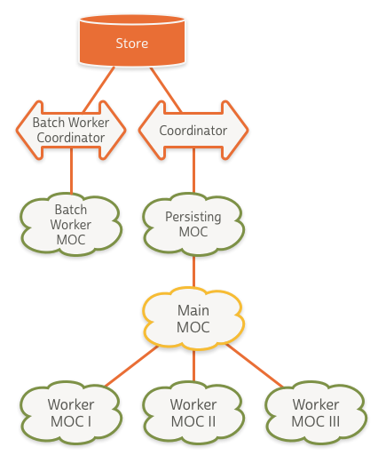

# BNR CoreData Stack
[](https://github.com/Carthage/Carthage)
[](https://img.shields.io/cocoapods/v/BNRCoreDataStack.svg)
[](./LICENSE)

The BNR CoreData Stack is a small framework, written in Swift, that makes it easy to quickly set up a multi-threading ready CoreData stack.

## Minimum Requirements

- iOS 8.0
- Xcode 7.0
- Swift 2.0

## Installation

### [Carthage]

[Carthage]: https://github.com/Carthage/Carthage

Add the following to your Cartfile:

```
github "BigNerdRanch/CoreDataStack"
```

Then run `carthage update`.

Follow the current instructions in [Carthage's README][carthage-installation]
for up to date installation instructions.

[carthage-installation]: https://github.com/Carthage/Carthage/blob/master/README.md

### [CocoaPods]

[CocoaPods]: http://cocoapods.org

Add the following to your [Podfile](http://guides.cocoapods.org/using/the-podfile.html):

```ruby
pod 'BNRCoreDataStack'
```

You will also need to make sure you're opting into using frameworks:

```ruby
use_frameworks!
```

Then run `pod install`.

## Stack Design Patterns

The BNR CoreData stack provides a quick setup and a superior substitute to Xcode's _Use CoreData_ checkbox template for creating the necessary boilerplate code.

Ultimately though the real value comes with having a solid foundation for interfacing with CoreData in a multi-threaded environment. To best describe the design choices made in the BNR CoreData stack, we'll first walk through the various patterns of multi-threaded CoreData stacks. 

[Skip to usage info](#usage):


### <a id="shared_coordinator"></a> Shared Persistent Store Coordinator Pattern

The first pattern is constructed with a single persistent store coordinator, connected to a main queue managed object context. Background worker managed object contexts are created as needed and share the same single instance of the persistent store coordinator. 

Saving any one of these managed object contexts will push changes through the shared coordinator and on to the backing store file. While the changes from each context are available in the store after a save, no other context is aware of the changes made in any other context.

In order to keep all contexts in sync, the stack must subscribe to `NSManagedObjectContextDidSaveNotification` notifications and then call `mergeChangesFromContextDidSaveNotification()` on the remaining contexts.



#### Pros

- Worker contexts are kept in sync with each other
- Can be more performant with large data sets. More to come on [this](#shared_store).

#### Cons

- Greater complexity with setup to ensure consistency across contexts
- Increased chance of conflicting changes at the store level since they share a single coordinator
- Persistent store coordinator spends more time locking the store, affecting performance

### <a id="nested"></a> Nested Managed Object Context Pattern

In iOS 5.0 / OS X 10.7 Apple introduced the concept of nested managed object context through the property `parentContext`. Fetch requests performed on a context will work their way up through the contexts `parentContext`s until it reaches an `NSPersistentStore` where the objects are retrieved. Performing a save operation on a context will push the changes up a single level.


#### Pros

- Much simpler setup compared to [Shared Persistent Store Coordinator Pattern](#shared_coordinator)
- Children context always have most recent changes from parents available
- Minimizes contexts interfacing with the coordinator to a single context
- Writes to the store performed on a background queue

#### Cons

- Slower than [Shared Persistent Store Coordinator Pattern](#shared_coordinator) when inserting large data sets
- `awakeFromInsert` being called on `NSManagedObject` subclasses for each context in the parent chain
- Merge policies only apply to a context saving to a store and not to its parent context.

### <a id="shared_store"></a> Shared Store Stack Pattern

One criticism of the nested managed object context pattern, is that inserting a large number of objects (on the order of thousands) is significantly slower than doing the same operation with a shared persistent store coordinator stack. See [Concurrent CoreData Stack Performance Shootout](http://floriankugler.com/2013/04/29/concurrent-core-data-stack-performance-shootout/) For this reason some have outright avoided using a [nested managed object context pattern](#nested) all together in favor of the [shared persistent store coordinator pattern](#shared_coordinator).

Apple however recommends an alternate approach for solving this type of performance issue.

> If you've exhausted all other optimizations and still seeing performance issues, you might want to consider using a different concurrency style, and this time you have two persistent store coordinators, two almost completely separate Core Data stacks. One stack for your background work, one stack for your main queue work and they both talk to the same persistent store file.

via WWDC 2013 Session 211 - Core Data Performance Optimization and Debugging ([video](https://developer.apple.com/videos/wwdc/2013/#211), [transcript](http://asciiwwdc.com/2013/sessions/211))



This setup allows the two stacks to work entirely in parallel with the exception of locking the store file, which is a very fast operation. 

The changes could be propagated across context using the same pattern described in [shared persistent store coordinator pattern](#shared_coordinator) using `mergeChangesFromContextDidSaveNotification()`. However since this pattern is built for performance, its preferable to simply listen for the `NSManagedObjectContextDidSaveNotification` and re-perform your fetch request on the main queue context stack. This will be considerably faster than trying to merge thousands of objects between the two stacks.

#### Pros

- Much faster when inserting large data sets

#### Cons

- Heavy weight setup when creating the background context because of the need to create an entire stack
- More complex setup compared to [nested managed object context pattern](#nested)
- Syncing changes between stacks is manual

### The BNR CoreData Stack

This brings us to the BNR CoreData Stack. For us the simplicity of the [nested managed object context pattern](#nested) greatly outweighs any performance deficiencies.

At the root of our stack is a `PrivateQueueConcurrencyType` managed object context that handles writing to our store. Since this context is on a private queue we benefit from moving disk writing off the main queue. There should be no need to perform fetch request or call `save()` on this context directly.

The root context has one child context which is a `MainQueueConcurrencyType` context. This context should be used for any main queue or UI related tasks. Examples include setting up an `NSFetchedResultsController`, performing quick fetches, making UI related updates like a bookmark or favoriting an object.

For any longer running task, such as inserting or updating data from a web service, you should use a new background worker context. The stack will vend you one via the `newBackgroundWorkerMOC()` function.

Since saving an `NSManagedObjectContext` will only propagate changes up a single level to the `parentContext`, the BNR CoreData Stack listens for save notifications and ensures that the changes get persisted all the way up the chain to your store.

Recognizing that at times you may need to perform a large import operation where the nested context performance would be the bottleneck, we've included a function to vend you a managed object context with its own stack `newBatchOperationContext(setupCallback: CoreDataStackBatchMOCCallback)`. This follows the pattern outlined in [Shared Store Stack Pattern](#shared_store).



#### Asynchronous Setup

The BNR CoreData stack can be constructed with either an `NSSQLiteStoreType` store or an `NSInMemoryStoreType` store. Since a SQLite backed store could potentially need to perform model migrations and take an indefinite amount of time, the stack construction is asynchronous. Similarly, creating a new batch operation context will also be asynchronous since it relies on constructing a discrete stack of its own. For usage details see [Usage - Standard SQLite Backed](#sqlite_construct)

## <a id="usage"></a> Usage

### Constructing Your Stack

#### Import Framework

via: Carthage

```
import CoreDataStack
```

or via CocoaPods

```
import BNRCoreDataStack
```

#### <a id="sqlite_construct"></a> Standard SQLite Backed

```
CoreDataStack.constructSQLiteStack(withModelName: "TestModel") { result in
	switch result {
	case .Success(let stack):
		self.myCoreDataStack = stack
		print("Success")
	case .Failure(let error):
		print(error)
	}
}
```

#### In-Memory Only

```
do {
	myCoreDataStack = try CoreDataStack.constructInMemoryStack(withModelName: "TestModel")
} catch {
	print(error)
}
```

### Working with Managed Object Contexts

#### <a id="persisting_moc"></a> Private Persisting/Coordinator Connected Context

This is the root level context with a `PrivateQueueConcurrencyType` for asynchronous saving to the `NSPersistentStore`. Fetching, Inserting, Deleting or Updating managed objects should occur on a child of this context rather than directly.

```
myCoreDataStack.privateQueueContext
```

#### <a id="main_moc"></a> Main Queue / UI Layer Context

This is our `MainQueueConcurrencyType` context with its parent being the [private persisting context](#persisting_moc). This context should be used for any main queue or UI related tasks. Examples include setting up an `NSFetchedResultsController`, performing quick fetches, making UI related updates like a bookmark or favoriting an object. Performing a save() call on this context will automatically trigger a save on its parent via `NSNotification`.

```
myCoreDataStack.mainQueueContext
``` 

#### <a id="worker_moc"></a> Creating a Worker Context

Calling `newBackgroundWorkerMOC()` will vend us a `PrivateQueueConcurrencyType` child context of the [main queue context](#main_moc). Useful for any longer running task, such as inserting or updating data from a web service. Calling save() on this managed object context will automatically trigger a save on its parent context via `NSNotification`.

```
let workerContext = myCoreDataStack.newBackgroundWorkerMOC()
workerContext.performBlock() {
    // fetch data from web-service
    // update local data
    workerContext.saveContext()
}
```

#### Large Import Operation Context

In most cases, offloading your longer running work to a [background worker context](#worker_moc) will be sufficient in alleviating performance woes. If you find yourself inserting or updating thousands of objects then perhaps the [shared store pattern](#shared_store) is a good fit for your use case. The following WWDC videos are helpful in ensuring you've done your due-diligence to optimize your fetches, inserts and queries before opting to go this route:

- [Core Data Performance Optimization and Debugging](https://developer.apple.com/videos/wwdc/2013/?include=211#211)
- [Optimizing Your Core Data Application](http://developer.apple.com/devcenter/download.action?path=/wwdc_2004/adc_on_itunes__leopard_sessions_from_wwdc07__mac_os_x_essentials/105_cc.mov)
- [Optimizing Core Data Performance on iPhone OS](https://developer.apple.com/devcenter/download.action?path=/videos/wwdc_2010__hd/session_137__optimizing_core_data_performance_on_iphone_os.mov)

```
myCoreDataStack.newBatchOperationContext() { result in
    switch result {
    case .Success(let batchContext):
        // my big import operation
    case .Failure(let error):
        print(error)
    }
}
```

### Resetting The Stack

At times it can be necessary to completely reset your CoreData store and remove the file from disk for example when a user logs out of your application. An `NSSQLiteStoreType` stack can be reset using the function `resetSQLiteStore(resetCallback: CoreDataStackSQLiteResetCallback)`.


```
myCoreDataStack.resetSQLiteStore() { result in
    switch result {
    case .Success:
        // proceed with fresh CoreData Stack
    case .Failure(let error):
        print(error)
    }
}
```

## About

[](http://bignerdranch.com)

- We [Develop][develop] custom apps for clients around the world.
- We [Teach][teach] immersive development bootcamps.
- We [Write][write] best-selling Big Nerd Ranch Guides.

[develop]: https://www.bignerdranch.com/we-develop/
[teach]: https://www.bignerdranch.com/we-teach/
[write]: https://www.bignerdranch.com/we-write/